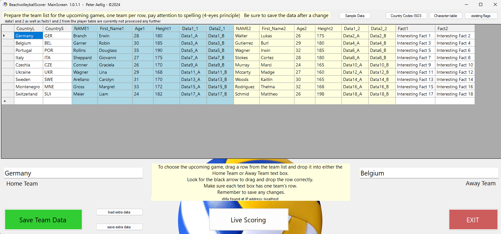
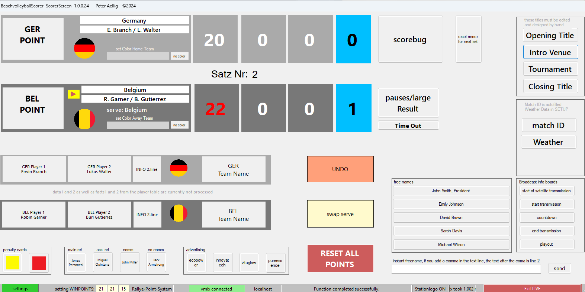
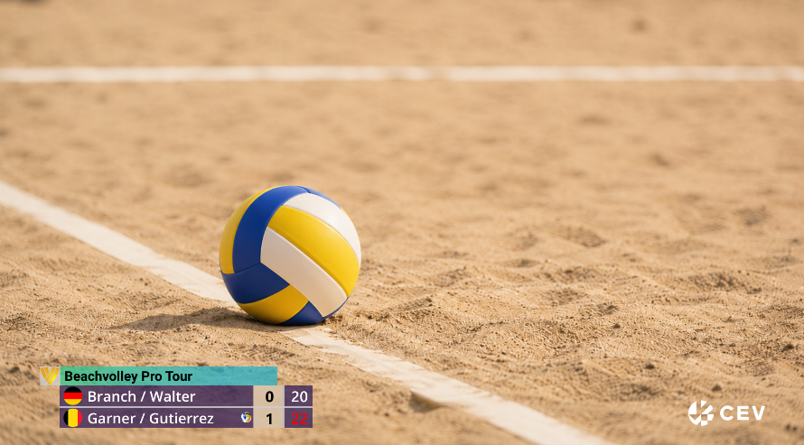
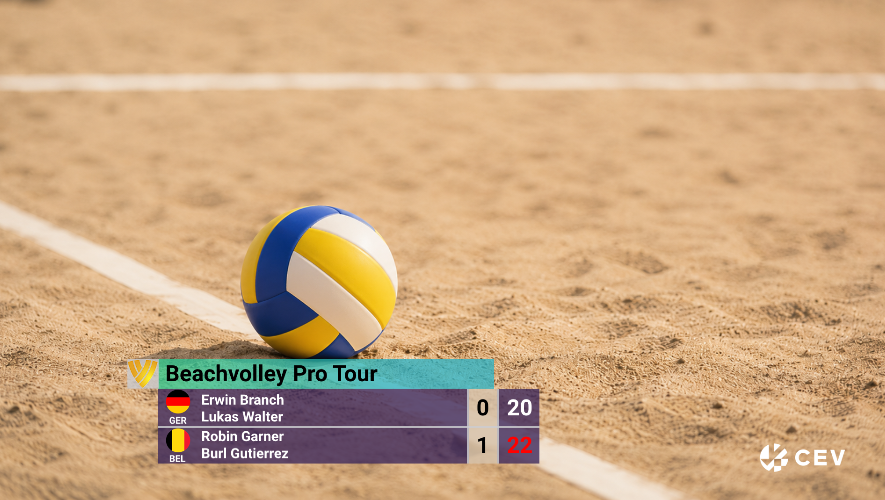
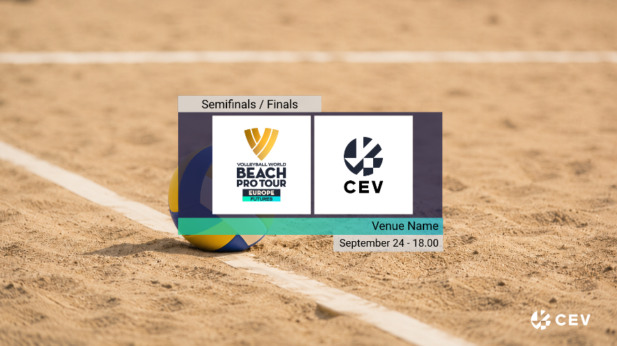

# BEACH VOLLEYBALL SCORER

**Live beach volleyball scoring and graphics control for vMix**

One interface for team preparation, rally scoring, match operation, and
broadcast graphics.

`Windows Forms` · `.NET Framework 4.8` · `vMix GT Titles` · `HTTP` · `TCP`

---

## Overview

Beach Volleyball Scorer is a Windows Forms application for operating a beach
volleyball match in a live vMix production. It manages team and player data,
applies rally-point scoring, tracks service and sets, and drives the supplied
vMix GT title package from a single operator interface.



The software is designed around the standard best-of-three beach volleyball
format. Default set targets are 21 points for sets one and two and 15 points
for the deciding set; these values can be changed in Settings.

## Live operation



Before the match, teams are selected from the team list and assigned by drag
and drop to the Home and Away positions. Each team record can contain:

- Country and ISO3 country code
- Two player names
- Player ages and heights
- Additional text and facts for graphics
- A flag image selected by ISO3 code

During the match, the operator records points with dedicated Home and Away
buttons. The application updates the score, sets, serving team, team colors,
and connected vMix graphics. An Undo function corrects the most recent scoring
mistake, while reset controls prepare the next set or a new match.

## Broadcast graphics

<table>
<tr>
<td width="50%"></td>
<td width="50%"></td>
</tr>
<tr>
<td align="center">Scorebug</td>
<td align="center">Large result</td>
</tr>
</table>

The included assets cover more than the live score:

- Standard and large score graphics
- Player and team lower thirds
- Match ID and tournament information
- Opening, venue, tournament, and closing titles
- Referee, commentator, and free-name inserts
- Weather information
- Time-out and interruption graphics
- Transmission start, countdown, end, and playout boards
- Advertising inserts
- Station logo
- Yellow, red, and yellow-red penalty cards



All supplied GT title templates, flags, logos, source artwork, backgrounds, and
sample configuration files are stored in [`vMixAssets/`](vMixAssets).

## Requirements

- Windows 10 or Windows 11
- .NET Framework 4.8
- vMix with GT Title support
- Visual Studio with the Visual Basic/.NET desktop workload when building from
  source

## Installing the vMix assets

The application expects its runtime assets at:

```text
C:\vMix\Beachvolleyball\
```

Copy the **contents** of the repository's `vMixAssets` directory to that path:

```text
vMixAssets\                    C:\vMix\Beachvolleyball\
├── advertising\       ->      advertising\
├── flags\             ->      flags\
├── graphical templates\ ->    graphical templates\
├── stationlogo\       ->      stationlogo\
├── testbg\            ->      testbg\
├── titles\            ->      titles\
├── weatherLogos\      ->      weatherLogos\
├── settings.xml       ->      settings.xml
└── volley.xml         ->      volley.xml
```

The paths in the supplied `settings.xml` already point to this directory.
Inside the application, **Install GTZIP Inputs** can load the configured title
inputs into vMix, and **Check Missing Files** verifies that the referenced
assets are present.

## Configuration

Open **Settings** before the first live match and configure:

| Section | Covers |
|---|---|
| **vMix connection** | Host name or IP address, HTTP port, TCP port, and transport |
| **Scoring** | Winning points for all three sets |
| **Event** | Tournament, venue, match, and title information |
| **Production team** | Referees, commentators, and free-name inserts |
| **Graphics** | GTZIP paths, advertising, station logo, and additional media |
| **Weather** | Weather icon, temperature, wind, and humidity |

The default vMix ports are `8088` for HTTP and `8099` for TCP. Use
`localhost` when the scorer and vMix run on the same computer; otherwise enter
the vMix computer's network address.

Settings are stored in:

```text
C:\vMix\Beachvolleyball\settings.xml
```

## Team data

The default team database is:

```text
C:\vMix\Beachvolleyball\volley.xml
```

The start screen can load or save another XML file if required. Country codes
use ISO3/FIFA-style abbreviations and correspond to image file names in the
`flags` directory. Sample data is available for testing, and the application
can display the installed flag list.

## Typical production workflow

1. Copy `vMixAssets` to `C:\vMix\Beachvolleyball`.
2. Start vMix and open Beach Volleyball Scorer.
3. Configure the connection and graphics paths in Settings.
4. Install the configured GTZIP inputs or add them manually in vMix.
5. Prepare and save the team list.
6. Drag the two teams into the Home and Away positions.
7. Open Live Scoring, choose team colors, and reset all points.
8. Select the initial serving team.
9. Record every rally with the Home or Away point button.
10. Switch the scorebug and other graphics on or off as required.

Test the complete setup before using it in a live production.

## Building from source

1. Open `Volleyball24.sln` in Visual Studio.
2. Select the `Debug` or `Release` configuration.
3. Build the solution.

The project targets .NET Framework 4.8 and does not require a checked-in NuGet
package directory.

## Repository contents

| Path | Contents |
|---|---|
| Repository root | VB.NET Windows Forms source and solution |
| [`Documentation/screenshots/`](Documentation/screenshots) | Current application and graphics screenshots |
| [`vMixAssets/`](vMixAssets) | GT titles, flags, artwork, backgrounds, and sample XML files |

## Project status

This is a purpose-built broadcast production tool. It is provided as-is and
should be tested with the exact vMix version, graphics package, and production
workflow used at the venue.
